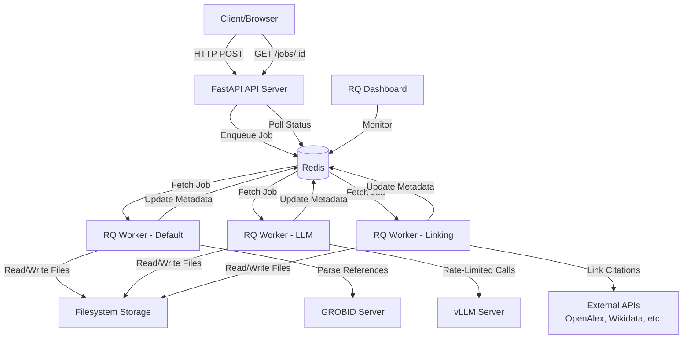
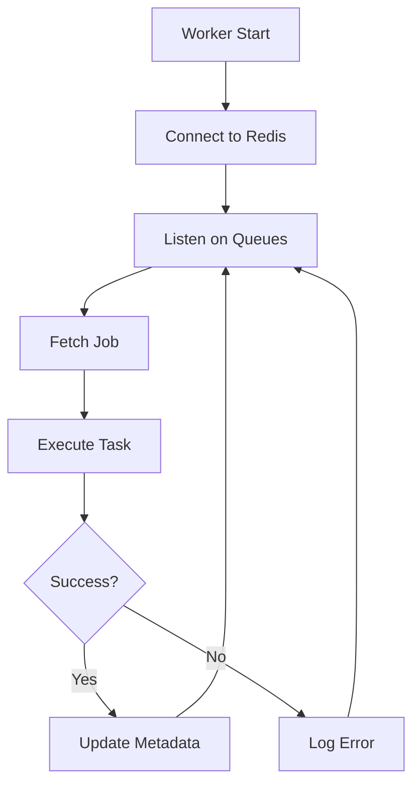
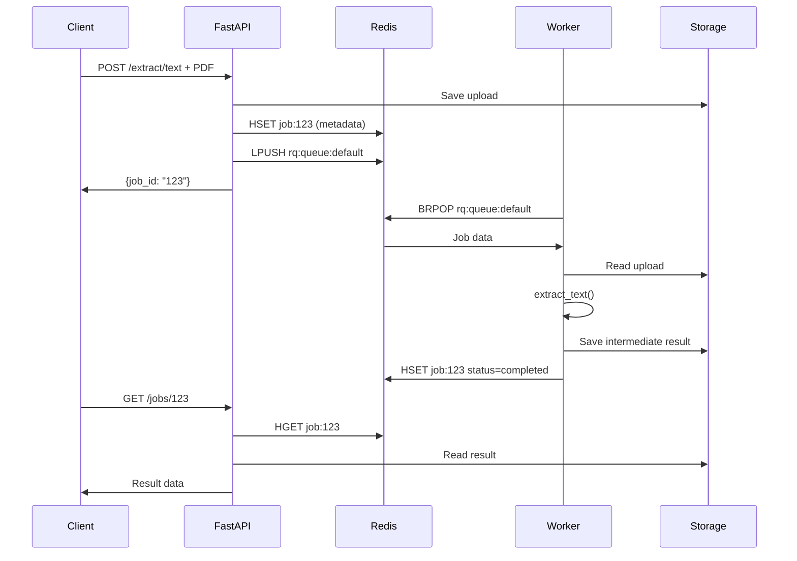
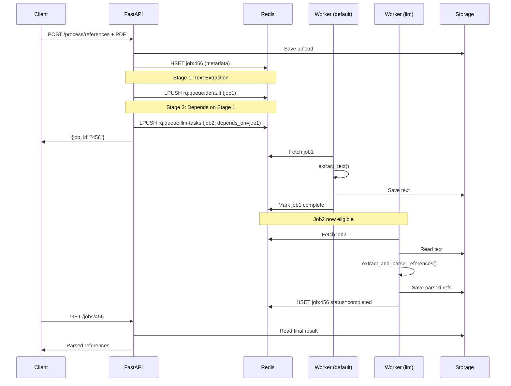
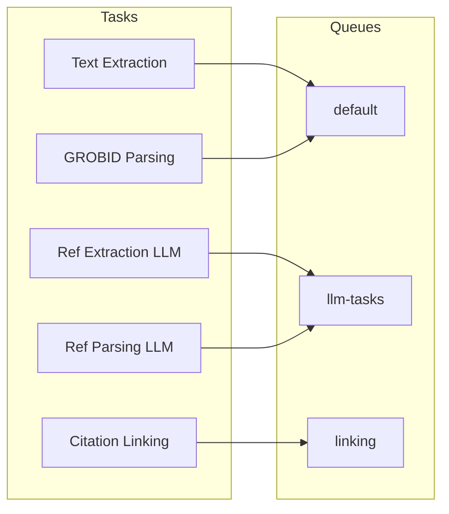
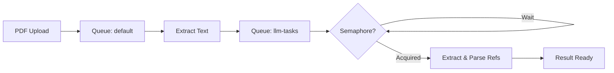
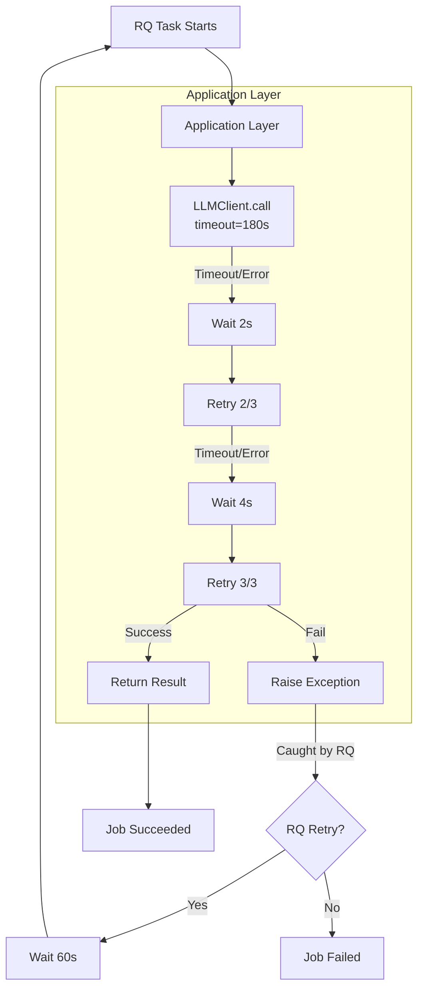

# Citation Index Architecture

Complete architecture documentation for the Citation Index queue system.

## System Overview



## Component Breakdown

### 1. FastAPI Server (`api.py`)

**Role**: Accept HTTP requests, enqueue jobs, return status


**Key Files**:
- `src/citation_index/api.py` - FastAPI routes
- Port: 8000 (default)

**Endpoints**:
- `POST /extract/text` - Text extraction
- `POST /extract/references` - Reference extraction  
- `POST /parse/references` - Reference parsing
- `POST /process/references` - Full pipeline
- `GET /jobs/{id}/status` - Job status
- `GET /jobs/{id}` - Job result
- `GET /health` - Health check

### 2. Redis

**Role**: Message broker + job metadata store

```
Redis Keys:
├── rq:queue:default          # Queue: text extraction jobs
├── rq:queue:llm-tasks        # Queue: LLM-based jobs
├── rq:queue:linking          # Queue: citation linking jobs
├── job:{job_id}              # HASH: job metadata
├── job:{job_id}:events       # STREAM: job events (optional)
└── llm:semaphore             # Counter: LLM rate limiting
```

**Job Metadata (Redis HASH)**:
```json
{
  "job_id": "550e8400-e29b-41d4...",
  "status": "processing",
  "type": "full_reference_pipeline",
  "current_stage": "reference_parsing",
  "completed_stages": ["text_extraction"],
  "created_at": "2026-02-06T12:00:00",
  "started_at": "2026-02-06T12:00:05",
  "filename": "paper.pdf"
}
```

### 3. RQ Workers (`worker.py`)

**Role**: Process jobs from queues (one job at a time per worker)



**Worker Class**: Standard `Worker` (with process forking + heartbeats)
- Essential for long-running LLM tasks (10-15 minutes)
- Heartbeats prevent false "stuck job" detection
- Process isolation for better fault tolerance

**Worker Deployment**:

| Worker Pool | Queue | Task Duration | Replicas | Why |
|-------------|-------|---------------|----------|-----|
| worker-default | `default` | Fast (~30s-2min) | 2 | Always responsive for quick tasks |
| worker-llm | `llm-tasks` | Slow (~10-15min) | 6 | High count to drain queue despite slow tasks |
| worker-linking | `linking` | Medium (~1-3min) | 2 | External API calls |

**Key Insight**: 
- `worker-llm` has 6 replicas but semaphore limit is 4
- Workers 1-4: Call vLLM
- Workers 5-6: Wait for semaphore (have jobs ready!)
- When Worker 1 finishes → Worker 5 starts immediately (no gap!)
- This maximizes throughput while protecting vLLM

### 4. Storage Manager (`utils/storage.py`)

**Role**: Manage job files on filesystem

```
storage/
├── uploads/
│   └── {job_id}/
│       └── input.pdf
├── intermediate/
│   └── {job_id}/
│       ├── text_extraction/
│       │   └── output.json
│       ├── reference_parsing/
│       │   └── output.json
│       └── citation_linking/
│           └── output.json
└── results/
    └── {job_id}/
        └── result.json
```

**Key Features**:
- Atomic writes (temp → rename for idempotency)
- Job cleanup (delete files older than 24h)
- Shared filesystem (K8s PVC with ReadWriteMany)

### 5. Task Wrappers (`tasks.py`)

**Role**: Thin wrappers around existing pipeline functions

```python
@job('llm-tasks', timeout=900)
def extract_references_task(job_id: str, **params):
    # 1. Load input from storage
    text = storage.load_intermediate(job_id, 'text_extraction')
    
    # 2. Call existing pipeline function (no changes needed!)
    with llm_semaphore.acquire():
        refs = extract_text_references(text, llm_client, **params)
    
    # 3. Save output to storage
    storage.save_intermediate(job_id, 'reference_extraction', refs)
    
    # 4. Update metadata
    redis.hset(f"job:{job_id}", "status", "completed")
```

## Job Lifecycle

### Single-Stage Job



### Multi-Stage Pipeline



## Queue Strategy

### Queue Routing



**Rationale**:
- **default**: Fast, CPU-bound tasks (text extraction)
- **llm-tasks**: LLM calls (rate-limited, GPU-bound)
- **linking**: External API calls (I/O-bound, many retries)

### Worker Count vs Semaphore (Critical!)

**Why 6 workers but semaphore=4?**

```
6 LLM Workers (worker-llm replicas=6)
│
├─ Worker 1-4: Acquired semaphore → Calling vLLM
│              (4 concurrent vLLM requests - max capacity!)
│
└─ Worker 5-6: Have jobs, waiting for semaphore slots
               When Worker 1 finishes → Worker 5 starts IMMEDIATELY!
               (No gap, maximizes throughput)
```

**Purpose**:
- **Worker count (6)**: How many jobs "in flight" (some waiting)
- **Semaphore (4)**: Max concurrent vLLM calls (protects server)
- **Result**: Fast queue draining + vLLM protection

**Rule of thumb**: `workers = semaphore × 1.5 to 2`

### LLM Semaphore Implementation

```python
# In tasks.py - all LLM tasks use this
with llm_semaphore.acquire():
    result = llm_client.call(...)  # Max 4 workers here at once
```

**Algorithm** (Redis-based):
```python
# Atomic increment
current = redis.incr("llm:semaphore")
if current <= max_concurrent:  # Got a slot!
    do_llm_call()
    redis.decr("llm:semaphore")  # Release
else:
    redis.decr("llm:semaphore")  # Give back
    time.sleep(0.1)  # Retry
```

## Data Flow: Full Pipeline Example



**Storage Paths**:
- Upload: `storage/uploads/{job_id}/input.pdf`
- Intermediate: `storage/intermediate/{job_id}/{stage}/output.json`
- Final: `storage/results/{job_id}/result.json`

## Configuration

**Flow**: `.env` → `config.py` (Pydantic) → `api.py` / `worker.py` / `tasks.py`

**Key Settings**:
- **Redis**: `REDIS_HOST`, `REDIS_PORT`, `REDIS_PASSWORD`
- **LLM**: `LLM_ENDPOINT`, `LLM_MODEL`, `LLM_MAX_CONCURRENT` (semaphore limit)
- **Storage**: `STORAGE_ROOT` (filesystem path, e.g., `/mnt/pvc` in K8s)
- **Timeouts**: Per-stage timeouts in `config.py` (higher than app-level retries)

## Deployment Architectures

### Development (Docker Compose)

```bash
docker-compose up -d
# Services:
# - API (port 8000) - 2 replicas
# - Redis (port 6379)
# - worker-default (2 replicas)
# - worker-llm (6 replicas) - HIGH for slow tasks!
# - worker-linking (2 replicas)
# - RQ Dashboard (port 9181)
# - Shared volume: ./storage
```

### Production (Kubernetes/OKD)

**Components**:
- **API Deployment**: 2-4 pods (horizontal scaling)
- **Worker Deployments**: 
  - `worker-default`: 2 pods
  - `worker-llm`: 6-8 pods (scale based on LLM_MAX_CONCURRENT)
  - `worker-linking`: 2 pods
- **Redis**: StatefulSet or managed service
- **Storage**: PersistentVolumeClaim (ReadWriteMany, 100Gi+)

**External Services**: vLLM, GROBID (HTTP endpoints)

## Error Handling & Retry Strategy

### Two-Layer Timeout/Retry



**Layer 1 - Application (Already Exists)**:
- `LLMClient`: 180s timeout, 3 retries, exponential backoff
- `GrobidClient`: 180s timeout, 3 retries, fixed delays
- Connectors: Various timeouts with retry logic

**Layer 2 - RQ (New)**:
- Job wrapper timeout: 900s (allows app retries to complete)
- RQ retries: 1-2 (only for worker crashes, not API failures)

### Idempotency

Tasks check for existing output before executing:
1. Check `storage/intermediate/{job_id}/{stage}/output.json`
2. If exists → return cached result
3. If not → execute, write to `.tmp`, then atomic rename

**Atomic writes prevent partial results** (worker crash = no corrupt file)

## Monitoring

### Health Checks

- **API**: `GET /health` → Redis + storage status
- **Workers**: RQ Dashboard at `http://localhost:9181`

### Job Tracking

- **Metadata**: Redis HASH `job:{id}` (status, stage, timestamps)
- **Events** (optional): Redis Stream `job:{id}:events`

### Key Metrics

| Metric | Source | Purpose |
|--------|--------|---------|
| Queue length | Redis `LLEN rq:queue:*` | Backlog monitoring |
| Active workers | RQ Dashboard | Worker health |
| Job success rate | Redis job metadata | Success tracking |
| LLM semaphore | Redis `GET llm:semaphore` | Concurrency usage |
| Storage size | Filesystem `du -sh storage/` | Disk usage |

## Performance Tuning

### Bottlenecks & Solutions

| Symptom | Cause | Solution |
|---------|-------|----------|
| High API latency | Too few API pods | Scale API replicas |
| Growing queue | Not enough workers | Scale worker replicas |
| Workers idle | Dependency blocking | Check job dependencies |
| LLM timeouts | Semaphore too high | Decrease `LLM_MAX_CONCURRENT` |
| Slow I/O | Storage bottleneck | Faster disk or caching |

### Scaling Guide

| Component | Low Load | Medium Load | High Load |
|-----------|----------|-------------|-----------|
| API replicas | 1 | 2 | 4 |
| worker-llm | 2 | 6 | 12 |
| LLM_MAX_CONCURRENT | 2 | 4 | 8 |

**Rule**: `worker-llm replicas = LLM_MAX_CONCURRENT × 1.5-2`

## Security Considerations

### Production Checklist

- [ ] Redis password authentication (`REDIS_PASSWORD`)
- [ ] API rate limiting (per client IP)
- [ ] File size limits (prevent DoS via large PDFs)
- [ ] Input validation (PDF format verification)
- [ ] Network policies (restrict worker → external access)
- [ ] Storage quota limits (prevent disk exhaustion)
- [ ] Log sanitization (remove sensitive data)
- [ ] HTTPS/TLS for API (via Ingress)

## Troubleshooting Guide

### Common Issues

| Issue | Symptom | Solution |
|-------|---------|----------|
| Job stuck in "queued" | Status never changes | Check worker logs, ensure workers running |
| Worker crash | Jobs fail immediately | Check RAM, LLM endpoint reachable |
| LLM timeout | Jobs fail after 15 min | Increase `LLM_MAX_CONCURRENT` or add GPU |
| Storage full | Errors saving files | Clean old jobs: `storage.cleanup_old_jobs()` |
| Redis connection lost | All jobs fail | Check Redis health, restart if needed |

### Debug Commands

```bash
# Check queue lengths
docker-compose exec redis redis-cli LLEN rq:queue:default
docker-compose exec redis redis-cli LLEN rq:queue:llm-tasks

# Check active workers
docker-compose exec redis redis-cli KEYS rq:worker:*

# Check job metadata
docker-compose exec redis redis-cli HGETALL job:YOUR_JOB_ID

# Check LLM semaphore usage
docker-compose exec redis redis-cli GET llm:semaphore

# Worker logs
docker-compose logs -f worker-llm

# Storage usage
du -sh storage/
```

## References

- **RQ Documentation**: https://python-rq.org/
- **FastAPI Documentation**: https://fastapi.tianglio.com/
- **Redis Documentation**: https://redis.io/docs/
- **Pydantic Settings**: https://docs.pydantic.dev/latest/concepts/pydantic_settings/
